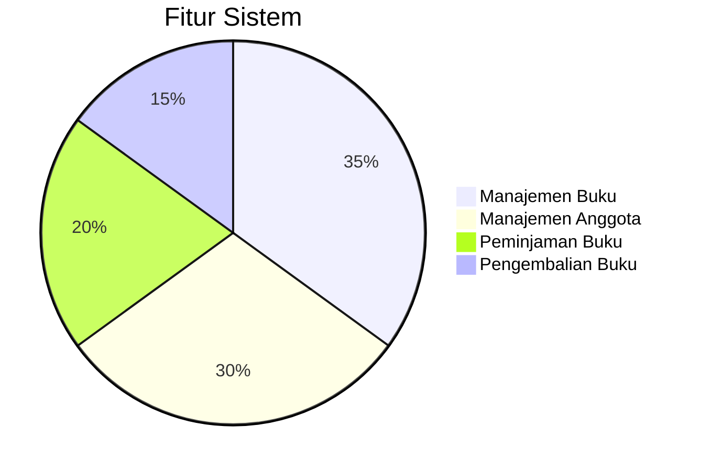
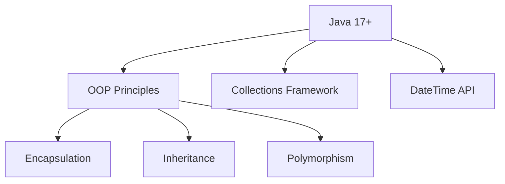
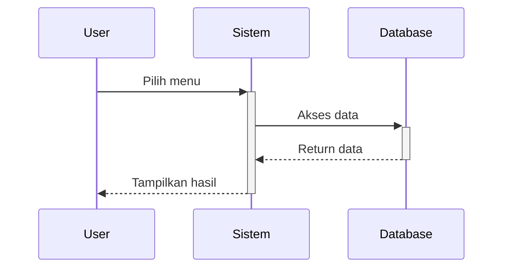

# 📚 Sistem Manajemen Perpustakaan - UTS PBO

**"Membaca adalah jendela dunia, kami memudahkan aksesnya"**


## 🏆 Tim Pengembang

| Role | Nama | NIM |
|------|------|-----|
| Ketua | Ahmad Fauzan Abdurrohman | 22110007 |
| Wakil | Rifky Andriansyah | 22110209 |
| Anggota | Naida Putri Asyaidah | 22110054 |
| Anggota | Intan Nurlatifah | 22110337 |
| Anggota | Rinda Tiara | 22110382 |
| Anggota | Nike Fitria | 22110598 |
| Anggota | Egi Hermawan | 22110641 |
| Anggota | Nur Aziizah Febrianti | 22110648 |

## 🌟 Fitur Utama



- **📖 Manajemen Buku**:
  - Tambah buku fiksi/non-fiksi
  - Cari buku berdasarkan judul/kode
  - Tampilkan daftar buku lengkap

- **👥 Manajemen Anggota**:
  - Pendaftaran anggota baru
  - Hapus anggota
  - Lihat daftar anggota

- **🔄 Transaksi**:
  - Peminjaman buku dengan opsi booking
  - Pengembalian buku dengan perhitungan denda
  - Riwayat peminjaman aktif

- **📊 Dashboard**:
  - Tampilan tabel informasi lengkap
  - Statistik perpustakaan
  - Antarmuka berbasis konsol yang elegan

## 🛠️ Teknologi



- **Java Standard Edition** (versi 17+)
- **Pemrograman Berorientasi Objek**:
  - Class, Inheritance, Polymorphism
  - Encapsulation dengan getter/setter
- **Struktur Data**:
  - Array untuk penyimpanan
  - HashMap untuk manajemen peminjaman
- **Java Time API** untuk manajemen tanggal

## 🚀 Cara Menjalankan

1. **Persyaratan**:
   - JDK 17 atau lebih baru
   - Terminal/Command Prompt

2. **Kompilasi**:
   ```bash
   javac *.java
   ```

3. **Eksekusi**:
   ```bash
   java Main
   ```

4. **Demo**:
   ```bash
   # Contoh interaksi
   Pilih menu: 9
   # Akan menampilkan tabel informasi lengkap
   ```

## 🎨 Tampilan Sistem

```bash
╔════════════════════════════════════════════════════════════════════════════════╗
║                          TABEL SELURUH INFORMASI PERPUSTAKAAN                   ║
╠════════════════════════════════════════════════════════════════════════════════╣
║                                                                                ║
║  📚 DAFTAR BUKU (2 buku)                                                       ║
║                                                                                ║
╠══════════════╦══════════════════════════╦════════════╦════════╦═══════════════╣
║ Kode         ║ Judul                    ║ Penulis    ║ Tahun  ║ Status        ║
╠══════════════╬══════════════════════════╬════════════╬════════╬═══════════════╣
║ F001         ║ Harry Potter             ║ J.K. Rowli ║ 1997   ║ Tersedia      ║
║ NF001        ║ Sapiens                  ║ Noah Harari║ 2011   ║ Dipinjam      ║
╚══════════════╩══════════════════════════╩════════════╩════════╩═══════════════╝
```

## 📝 Laporan UTS

**Konsep OOP yang Diterapkan**:
1. **Encapsulation**:
   - Semua field dibuat private
   - Akses melalui getter/setter
2. **Inheritance**:
   - Class `BukuFiksi` dan `BukuNonFiksi` mewarisi `Buku`
3. **Polymorphism**:
   - Override method `tampilkanInfo()`
4. **Abstraction**:
   - Class abstract dan interface (jika diperlukan)

**Alur Kerja Sistem**:


## 📌 Catatan Proyek

- Dibangun untuk memenuhi UTS Pemrograman Berorientasi Objek
- Mengimplementasikan seluruh konsep dasar OOP
- Antarmuka konsol yang user-friendly
- Dilengkapi dengan sistem denda otomatis

## 📜 License

MIT License - Hak cipta © 2025 Tim 3 PBO UTS

---

<div align="center">
  <h3>Dikembangkan dengan ❤️ oleh Tim 3 PBO UTS</h3>
  <p>"Membangun sistem untuk masa depan yang lebih terdidik"</p>
</div>